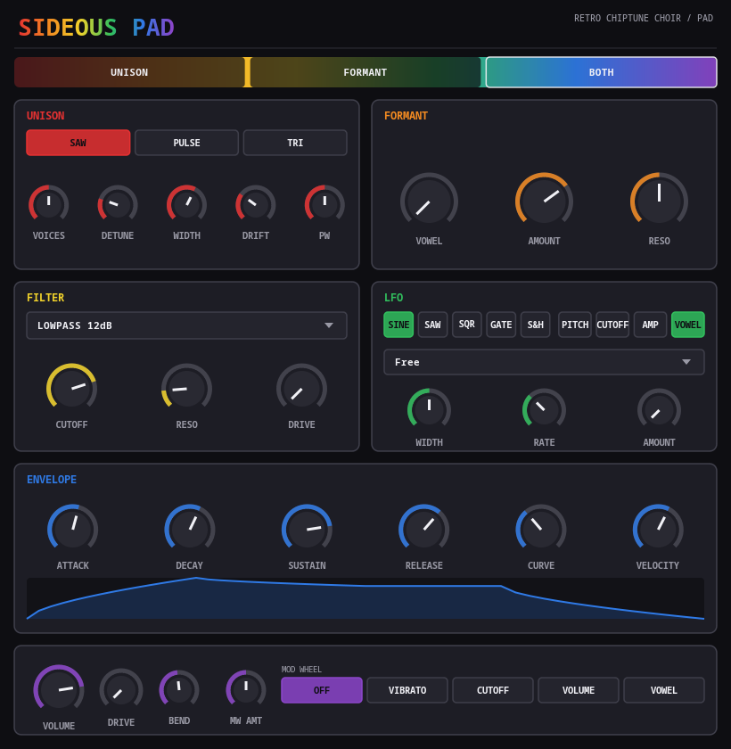

# Sideous Pad

> **⚠️ VIBE CODED SLOP.** This entire plugin — DSP, GUI, CI — was built through
> conversational back-and-forth with an AI, not hand-engineered from a spec.
> It works, it's been tested, but go in with appropriate expectations.

A retro chiptune choir/pad instrument (VST3 / LV2 / CLAP / JACK standalone),
built on [DPF](https://github.com/DISTRHO/DPF) with a hand-drawn Cairo-based
UI — a companion to [Sideous](https://github.com/marcin-koziol/Sideous-synth),
[Sideous Drums](https://github.com/marcin-koziol/Sideous-drums), and
[Sideous Noise](https://github.com/marcin-koziol/Sideous-noise), same family,
own pride-rainbow visual identity.

The core idea: two synthesis engines feed every voice, selectable per **Voice
Mode**. **Unison** stacks up to five detuned chip oscillators per note, each
with its own slow independent pitch drift, for width and movement — the
"pad" half. **Formant** runs the signal through a bank of resonant filters
tuned to vowel formants, continuously morphed across a single **Vowel** knob
(Ah → Eh → Ee → Oh → Oo) — the "choir" half. **Both** runs unison straight
into the formant bank for the thickest, most vocal result. The LFO can sweep
the Vowel knob itself for a slow "talking pad" effect.



## Features

- **Voice Mode**: Unison / Formant / Both — switches between a detuned
  chip-oscillator stack, a vowel formant filter bank, or both in series
- **Unison**: Saw/Pulse (variable pulse width)/Triangle, 1–5 voices, detune
  spread, stereo width, and per-voice pitch **Drift** (slow independent
  random wander) so a chord's voices don't breathe in lockstep
- **Formant**: 3-band resonant bandpass filter bank continuously morphed
  across a 5-vowel table via a single **Vowel** knob, plus a wet/dry
  **Amount** knob (used in Both mode) and shared **Resonance**
- **Filter**: switchable lowpass/highpass, 12dB and 24dB slopes, plus a
  simplified Moog-style ladder filter, with resonance and drive — runs after
  the formant stage as general tone shaping
- **Amp ADSR**: shapeable curve, velocity sensitivity, live curve-graph
  visualization, pad-appropriate slow defaults
- **LFO**: sine/saw/square/gate (adjustable duty cycle)/sample & hold,
  free-running or tempo-synced, routable to pitch, cutoff, amplitude, or
  **vowel** — the last one sweeps the formant morph for movement without
  automating a knob by hand
- **Performance controls**: pitch bend, mod wheel (routable to vibrato,
  cutoff, volume, or vowel)
- 8-voice polyphony (chord instrument, not a lead), true stereo signal path
  end-to-end so unison width survives the formant/filter stages
- Knobs show live values while being automated, not just while dragging

## Building

```sh
git clone --recursive <repo-url>
cd sideous-pad
cmake -S . -B build
cmake --build build -j$(nproc)
```

(If you already cloned without `--recursive`, run
`git submodule update --init --recursive` first.)

Built plugins land in `build/bin/` — `sideous-pad.vst3`, `sideous-pad.lv2`,
`sideous-pad.clap`, and a JACK/native-audio standalone (`sideous-pad`).

CI ([`.github/workflows/build.yml`](.github/workflows/build.yml)) builds
Linux, Windows, and macOS (universal) packages on every push and attaches
them to GitHub Releases for tagged versions.
